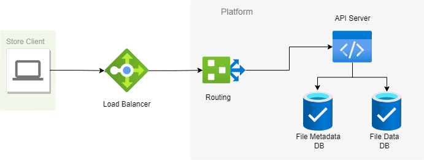

# Architecture

The database is a filesystem mapped key-value store.

Both the database are used together to reduce redundancy of data.

---

### File Metadata DB
This DB contains the filename as the key and checksum of the data as the value.

The checksum is used to map the data content of the file.

---

### File Data DB
This DB contains the checksum of the data as the key and the data of the file as value in byte array. 

At any point of time is there is only one copy of the file kept in the store that has same data.